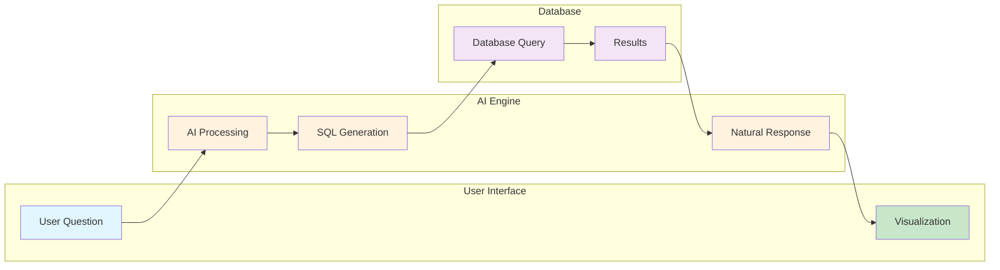
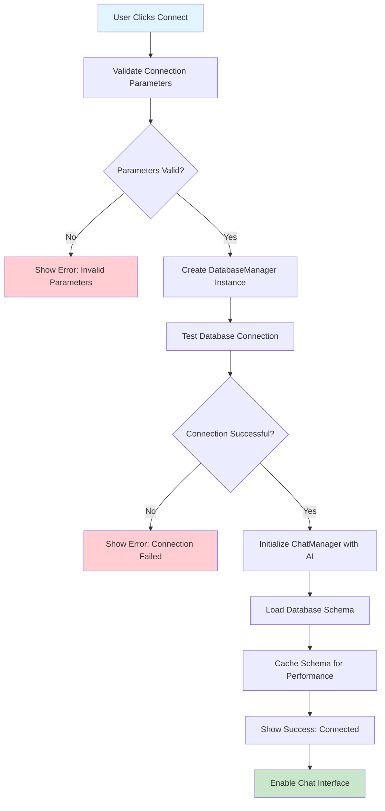
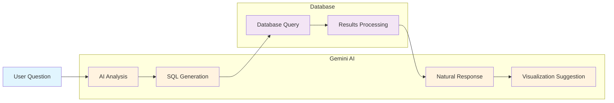
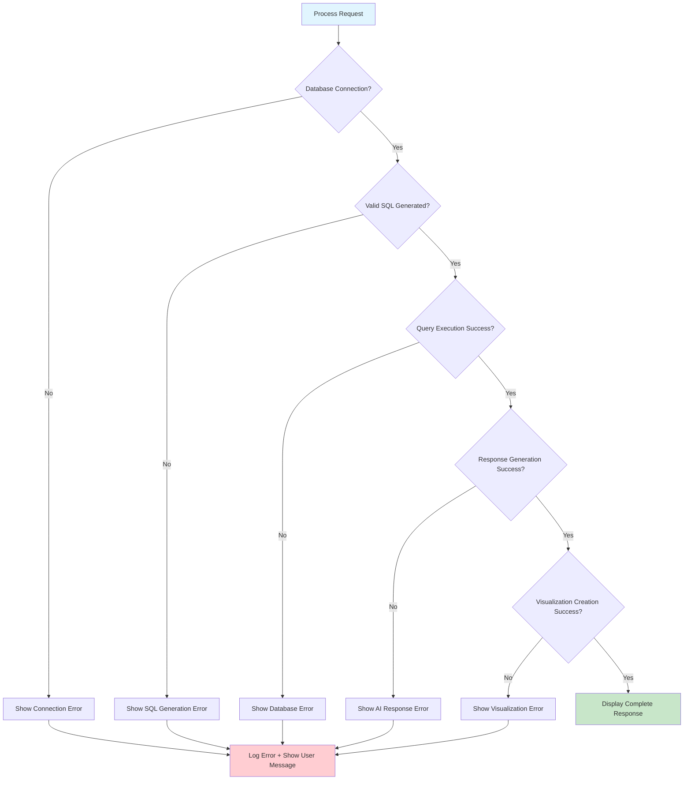
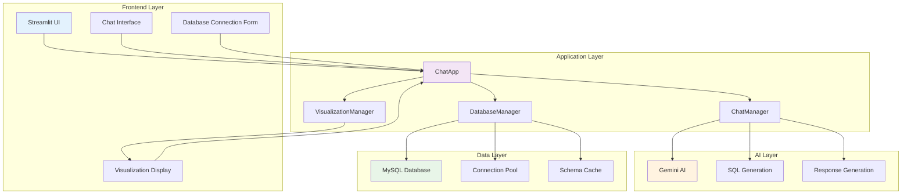
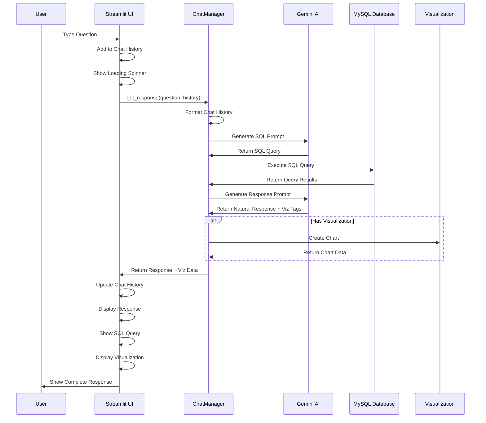
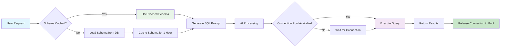

# Chat with MySQL - Application Flow Diagram

## Main Application Flow

## Database Connection Flow

## AI Processing Flow

## Error Handling Flow

## Component Architecture

## Data Flow Sequence

## Performance Optimization Flow

---

## Diagram Usage Instructions

These Mermaid diagrams can be:

1. **Embedded in Medium** using Mermaid support
2. **Converted to images** using online Mermaid editors
3. **Used in documentation** for technical explanations
4. **Shared in presentations** to explain the architecture

### Key Color Coding:
- 🔵 **Blue**: User interactions and inputs
- 🟢 **Green**: Successful completions and data sources
- 🟡 **Orange**: AI processing steps
- 🟣 **Purple**: Database operations
- 🔴 **Red**: Error handling paths 