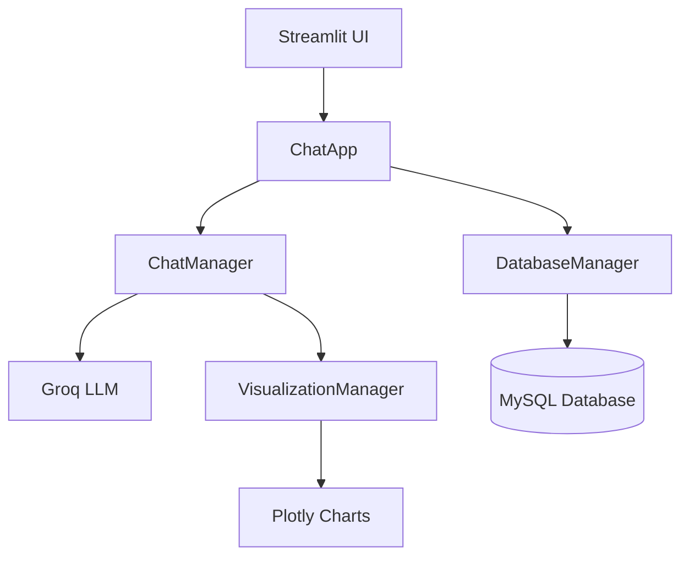
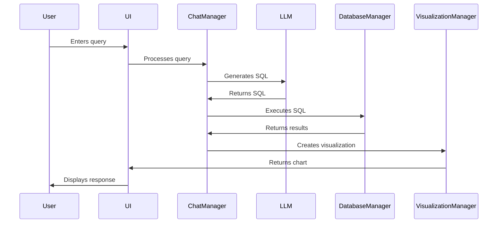
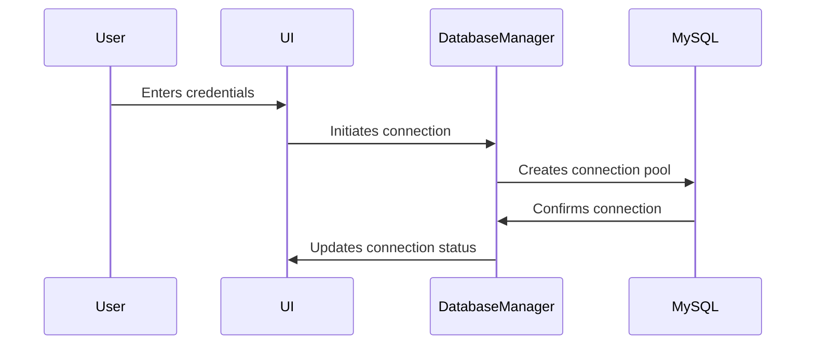

# Architecture Guide

## System Architecture

### High-Level Overview

## Component Interactions

### 1. User Interface Layer (app.py)
- **ChatApp Class**: Main application controller
  - Manages UI components and layout
  - Handles user interactions
  - Maintains session state
  - Coordinates between components

### 2. Business Logic Layer
#### ChatManager (chat_manager.py)
- Handles conversation flow
- Converts natural language to SQL
- Manages LLM interactions
- Coordinates visualization requests

#### DatabaseManager (database.py)
- Manages database connections
- Implements connection pooling
- Executes SQL queries
- Caches database schema

#### VisualizationManager (visualization_manager.py)
- Creates data visualizations
- Suggests appropriate chart types
- Handles data transformation
- Manages chart parameters

### 3. Configuration Layer (config.py)
- Manages environment variables
- Stores application settings
- Defines prompt templates
- Configures default values

## Data Flow

1. **User Input Flow**

2. **Database Connection Flow**

## State Management

### Session State Variables
- `chat_history`: List of conversation messages
- `is_connected`: Database connection status
- `chat_manager`: ChatManager instance
- `db_config`: Database configuration
- `current_viz`: Current visualization data

### Caching Strategy
1. **Database Schema**
   - Cached using `@lru_cache`
   - Invalidated on reconnection
   - Improves query performance

2. **Query Results**
   - Stored in DatabaseManager
   - Used for visualization
   - Limited to MAX_ROWS_DISPLAY

## Error Handling

### Layers of Error Handling
1. **UI Layer**
   - User input validation
   - Connection status checks
   - Friendly error messages

2. **Business Logic Layer**
   - Query validation
   - Connection error handling
   - LLM error handling

3. **Database Layer**
   - Connection pool management
   - Query execution errors
   - Resource cleanup

## Security Architecture

### 1. Credential Management
- Environment variables for API keys
- Session-based database credentials
- Masked password inputs

### 2. Database Security
- Connection pooling
- Parameterized queries
- Resource cleanup
- Limited connection lifetime

### 3. Input Validation
- Query sanitization
- Parameter validation
- Error boundaries

## Performance Considerations

### 1. Connection Management
- Connection pooling
- Connection reuse
- Proper cleanup

### 2. Caching
- Schema caching
- Query result caching
- Visualization data caching

### 3. UI Optimization
- Fixed chat input
- Efficient rerendering
- Proper state management 